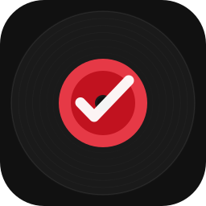

# DeckReady — Releases

This repository hosts downloadable releases of **DeckReady**, a macOS app that turns Spotify URLs, TIDAL URLs, or text tracklists into tagged music files organized for DJ use.

This repository hosts downloadable releases of **DeckReady**, a macOS app that turns Spotify URLs, TIDAL URLs, or text tracklists into tagged music files organized for DJ use.

## Download

## **[Download the latest release →](https://github.com/stephengeller/DeckReady-releases/releases/latest)**

1. Download `DeckReady-darwin-arm64.dmg` from the releases page.
2. Open the DMG and drag **DeckReady** to your Applications folder.
3. Follow the steps below to allow the app past macOS security — this is a one-time step.

---

## macOS Security (Gatekeeper)

DeckReady is not signed with an Apple Developer certificate, so macOS will block it on first launch. Here's how to open it anyway.

### Step 1 — Try to open the app

Double-click **DeckReady** in your Applications folder. You'll see a dialog like one of these:

- *"DeckReady cannot be opened because it is from an unidentified developer"*
- *"Apple cannot check it for malicious software"*

Click **OK** / **Cancel** to dismiss the dialog (don't worry — we'll fix it next).

### Step 2 — Allow it in System Settings

1. Open **System Settings** (Apple menu → System Settings)
2. Go to **Privacy & Security**
3. Scroll down to the **Security** section
4. You should see: *"DeckReady was blocked from use because it is not from an identified developer"*
5. Click **Open Anyway**
6. Enter your Mac password if prompted

### Step 3 — Confirm the final dialog

Go back to Applications and double-click **DeckReady** again. This time macOS will show a final confirmation dialog:

> *"macOS cannot verify the developer of DeckReady. Are you sure you want to open it?"*

Click **Open** — the app will launch and macOS will remember your choice from now on.

### Alternative: right-click to open

Instead of steps 1–3, you can right-click (or Control-click) **DeckReady** in Applications, choose **Open** from the menu, then click **Open** in the dialog. This bypasses Gatekeeper in one step.

---

## First Launch

Once open, a ♪ icon appears in your menu bar and the DeckReady UI opens automatically in your browser.

1. Click **Log in to TIDAL** and complete authentication in your browser
2. Paste a Spotify or TIDAL URL and click **Go**
3. Files are saved to `~/Music/DJLibrary` by default (configurable in the UI)

---

## Requirements

- macOS (Apple Silicon / M-series)
- Internet connection
- TIDAL account

## What it does

Paste a Spotify or TIDAL URL into the UI and click **Go**. DeckReady:

1. Fetches track metadata from Spotify or TIDAL
2. Finds and downloads matching audio via TIDAL
3. Converts to AIFF and organizes files in your music library

---

*Source code is private. For issues or questions, contact the maintainer.*
